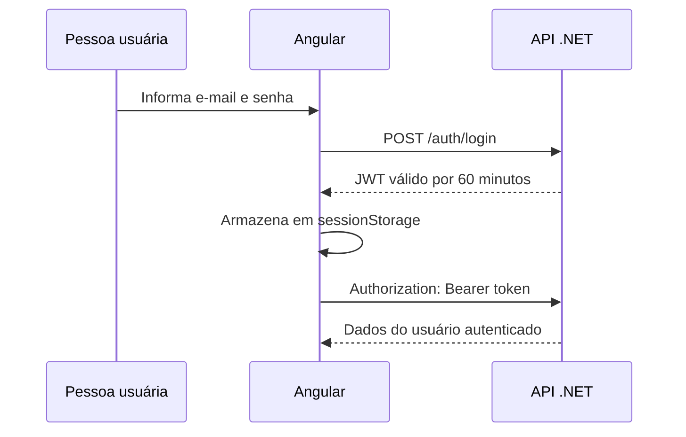

# Arquitetura do RV Personal Finance Web

> Estado atual: V1 do frontend implementada com autenticação, dashboard e cadastros integrados aos contratos da API.

## Objetivo e limites

O frontend Angular oferecerá uma interface em português para todas as capacidades atuais da API `rv-personal-finance`.

- O backend é a fonte de verdade para domínio, validações e contratos.
- O frontend não cria regras ou funcionalidades de negócio.
- A integração ocorre exclusivamente por HTTP/JSON.
- Mudanças no backend não fazem parte do escopo imediato.

## Visão C4 simplificada

```mermaid
%%{init: {
  "theme": "base",
  "flowchart": {
    "htmlLabels": false,
    "nodeSpacing": 70,
    "rankSpacing": 220,
    "diagramPadding": 24
  },
  "themeCSS": ".cluster-label text { fill: #334155 !important; paint-order: stroke; stroke: #f8fafc; stroke-width: 2px; stroke-linejoin: round; }",
  "themeVariables": {
    "background": "transparent",
    "primaryColor": "#f8fafc",
    "primaryTextColor": "#1f2937",
    "primaryBorderColor": "#64748b",
    "lineColor": "#64748b",
    "secondaryColor": "#f1f5f9",
    "tertiaryColor": "#ffffff",
    "clusterBkg": "transparent",
    "clusterBorder": "#94a3b8",
    "edgeLabelBackground": "#f8fafc",
    "fontFamily": "system-ui, sans-serif"
  }
}}%%
flowchart LR
    user["Pessoa usuária"]

    subgraph system["RV Personal Finance"]
        web["RV Personal Finance Web<br/>Angular"]
        api["RV Personal Finance API<br/>ASP.NET Core"]
        database[("PostgreSQL")]
    end

    user -->|"Gerencia suas finanças"| web
    web -->|"HTTP/JSON + JWT"| api
    api -->|"Entity Framework Core"| database

    classDef actor fill:#ffffff,stroke:#64748b,color:#1f2937,stroke-width:1.5px
    classDef application fill:#e2e8f0,stroke:#475569,color:#0f172a,stroke-width:1.5px
    classDef datastore fill:#f8fafc,stroke:#64748b,color:#1f2937,stroke-width:1.5px
    class user actor
    class web,api application
    class database datastore
    style system fill:transparent,stroke:#94a3b8,stroke-width:1px
```



No desenvolvimento, o Angular encaminhará `/api/**` para `http://localhost:5099`. O proxy remove o prefixo `/api`, pois a API publica seus endpoints na raiz.

## Estrutura proposta

```text
src/app/
├── core/
│   ├── api/
│   ├── auth/
│   └── errors/
├── layout/
├── shared/
├── features/
│   ├── auth/
│   ├── dashboard/
│   ├── accounts/
│   ├── categories/
│   └── transactions/
├── app.config.ts
└── app.routes.ts
```

Cada feature manterá próximos seus componentes, formulários, modelos, serviço HTTP e testes. `shared` conterá apenas elementos visuais realmente reutilizados.

## Telas e API

| Rota | Responsabilidade | Endpoints principais |
|---|---|---|
| `/login` | Iniciar sessão | `POST /auth/login` |
| `/register` | Cadastrar usuário | `POST /auth/register` |
| `/dashboard` | Exibir totais e gastos por categoria | `GET /dashboard` |
| `/accounts` | CRUD de contas e consulta de saldo | `/accounts`, `/accounts/{id}/balance` |
| `/categories` | CRUD de categorias | `/categories` |
| `/transactions` | CRUD de receitas e despesas | `/transactions` |

Criação e edição usarão diálogos nas telas de listagem. `GET /health` é operacional e não terá tela própria.

## Autenticação JWT



- Um interceptor funcional adicionará o token às requisições protegidas.
- Um guard protegerá as rotas internas.
- `401` encerrará a sessão local e redirecionará para `/login`.
- Não há refresh token ou logout no servidor.

## Decisões do frontend

| Tema | Decisão |
|---|---|
| Angular | Versão 22, componentes standalone e rotas por feature |
| Interface | pt-BR; código e identificadores em inglês |
| UI | Angular Material como única biblioteca visual |
| Formulários | Reactive Forms com validações equivalentes às da API |
| Estado | Estado local simples; sem biblioteca global |
| Dinheiro | Exibição em BRL, sem alterar os contratos da API |
| API | Serviços tipados por feature e envelope `ApiResult<T>` |
| Erros | Suporte ao envelope da API, Problem Details e falhas HTTP sem corpo |

## Limitações atuais da API

| Limitação | Impacto no frontend |
|---|---|
| Sem CORS | Requer proxy local ou reverse proxy no ambiente publicado |
| Sem paginação, filtros ou ordenação | Listas completas; ordenação apenas no cliente |
| Transações retornam somente IDs relacionados | Tela combina transações, contas e categorias |
| Dashboard sem período | Indicadores representam todo o histórico |
| Sem `/me`, refresh token ou logout | Sessão limitada ao JWT e ao e-mail presente no token |
| Cadastro sem validação dedicada | Frontend não deve inventar política de senha |
| E-mail sem normalização e unicidade no banco | Diferenças de caixa e concorrência permanecem no backend |
| Sem moeda no domínio | BRL é apenas uma decisão de apresentação |
| Sem prefixo ou versão da API | Proxy adiciona `/api` somente do lado do frontend |
